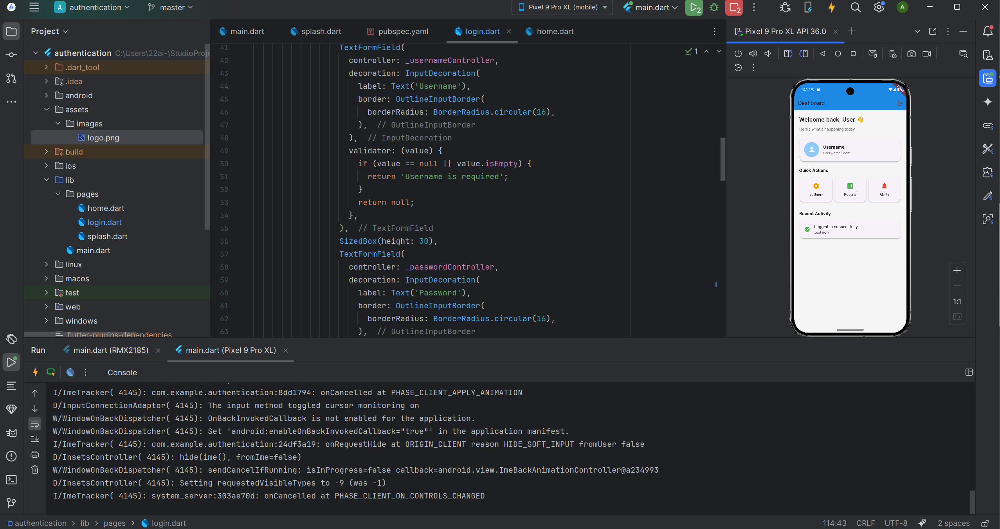

# 🔐 Flutter Basic Authentication App

A simple Flutter app demonstrating **basic user authentication** and **data flow** using `SharedPreferences`. It includes a splash screen, login validation, and a clean home dashboard with logout functionality.

&#x20;

---

## 📱 Features

* 🚀 Splash screen that checks login status
* 🧾 Form-based login with validation
* 📎 Persistent login using `SharedPreferences`
* 🏠 Simple dashboard UI after login
* 🔐 Logout option to clear session and return to login

---

## 🏗️ Project Structure

```
lib/
├── main.dart               # App entry point
└── pages/
    ├── splash.dart         # Splash screen with login check
    ├── login.dart          # Login form with validation
    └── home.dart           # Post-login dashboard
assets/
└── images/
    └── logo.png            # App splash logo
```

---

## 💪 Getting Started

### 1. Prerequisites

* Flutter SDK installed (recommended: stable channel)
* Android Studio / VS Code with Flutter plugins
* Internet connection (for package installation)

### 2. Clone the Repository

```bash
git clone https://github.com/aswiinnnnn/authentication_system_flutter.git
cd authentication_system_flutter
```

### 3. Install Dependencies

```bash
flutter pub get
```

### 4. Run the App

```bash
flutter run
```

---

## 🔑 Login Logic

* The app uses simple validation: **username and password must match**
* On successful login:

  * Saves a boolean `SAVE_KEY_NAME` in shared preferences
  * Redirects to `HomeScreen`
* On logout:

  * Clears the saved key
  * Navigates back to `LoginScreen`

---

## 📆 Dependencies

* [`flutter`](https://flutter.dev/)
* [`shared_preferences`](https://pub.dev/packages/shared_preferences)

Install them automatically using:

```bash
flutter pub get
```

---

## 📸 Screenshots

> 📌 A screenshot of the login screen will be added here soon.
> 


---

## 🧑‍💻 Author

**aswiinnnnn**
[GitHub](https://github.com/your-username) • [LinkedIn](https://linkedin.com/in/your-linkedin)

---

## 📝 License

This project is licensed under the [MIT License](LICENSE).

---

## 🙌 Acknowledgements

* Flutter documentation: [https://flutter.dev/docs](https://flutter.dev/docs)
* Community tutorials and resources
